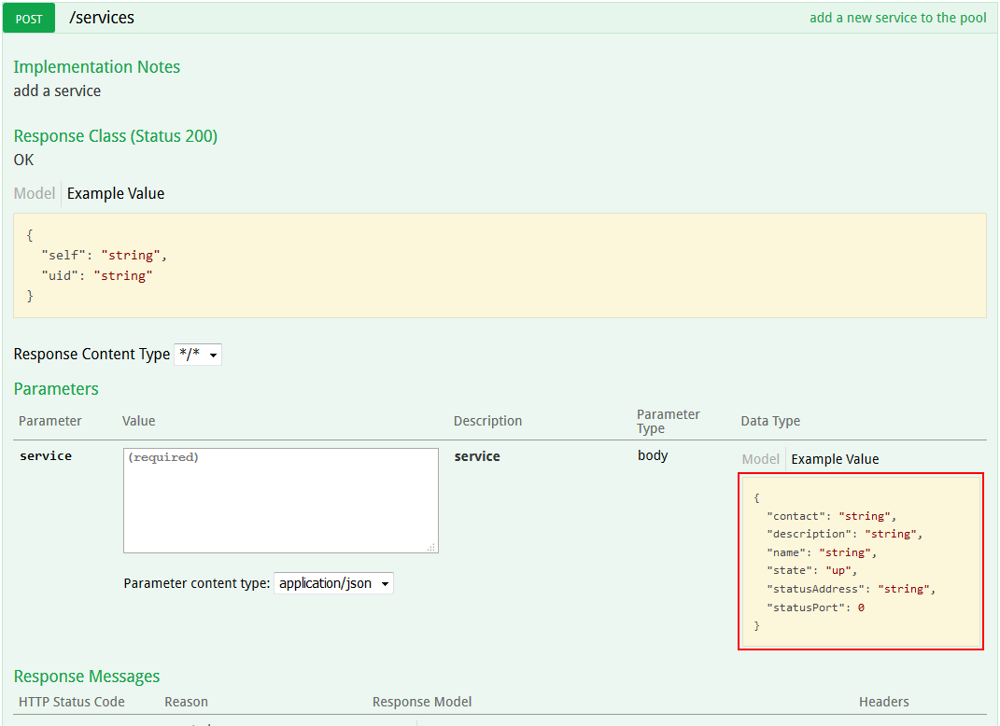
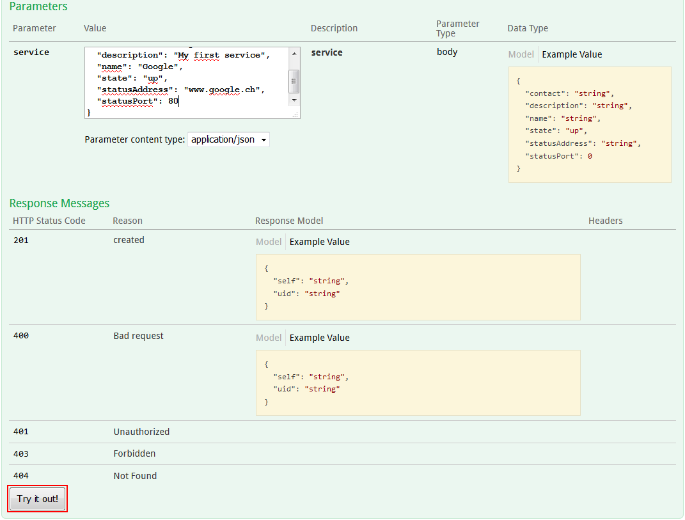

# Microservice-status
## Introduction
This API has been made during the course of *Multi-Tier Application* of the HEIG-VD. This API allows to keep a track of the condition of services. The user can manually change the state of a service or can provide the address of the service to have it checked periodically.
## Starting the application
Before using docker to start anything, there must be a *jar* file of the springboot server in */docker/microservice-status*. If there is none or if you want to build a new jar, run the *build-jar.sh* script. Note that **maven** must be installed in the machine running the script. You must be able to run *maven* command in a terminal.<br>
Go to */docker* folder and run command `docker-compose up --build`. Four container will be created : 
- **MySQL** : localhost:3306
- **phpMyAdmin** : [http://localhost:6060](http://localhost:6060)
- **angularJS** : [http://localhost:4444](http://localhost:4444)
- **Springboot Server** : [http://localhost:8080](http://localhost:8080)
### Add your first service
Open your browser and access to [http://localhost:8080/api](http://localhost:8080/api).
Click on *services* to open the endpoints of */services*, then on the **Post** method. <br/>
<br/>
Click on the JSON structure, under *Example Value*. This will copy the structure of the *service* as a JSON object for you to edit. <br/>
A *service* is represented by the following values :
```json
{
  "contact": "string",
  "description": "string",
  "name": "string",
  "state": "up",
  "statusAddress": "string",
  "statusPort": 0
}
```
---
#### Structure of a service
**Contact** : Name of the person to contact in case of problem <br/>
**Description** : Description of the service. <br/>
**Name\*** : Name of the service. <br/>
**State\*** : State in which the service is. Only 3 defined values are allowed : *up*, *down*, and *maintenance*.  <br/>
**Status address** : Address on which the service is accessible. This property is used along with the *port* to test the availability of the service automatically. If both of those properties are not set, the application will not attempt to test the service.<br/>
**Status port** : Port of the service. If you do not want to set a port, write *null* as the value of the port. <br/>
**\*** -> property that can not be empty<br/>

---
Change the value of the object to match your service. When you are ready to add you first service, scroll until the **Try it out!** button.<br/>
<br/>
If the service has correctly been inserted, the server should return a *201* response code. You will also be provided with the *UID* of the service.<br>

Now, browser to [http://localhost:4444](http://localhost:4444), to access the management interface.<br/>
<br/>

## API's endpoints
There is two different endpoint : */service* and */services*. The first is to access to a single service with its *UID*, while the latter is for general purposes with all services.

### /service/{serviceUID}
#### DELETE
Delete a single service with its *UID*.
#### GET
Get a service from its *UID*.  An object with the structure of a service seen above while be return. The object include the **_self_** value that is a link in the API to access the object.
#### PATCH
Update the status of the service. It require a parameter **_state_** with a value of **_up_**, **_down_** or **_maintenance_**.
#### PUT
Update a service. Allow to modify an existing service with its *UID*. The structure of the JSON object is the same as seen above.
### /services
#### DELETE
Delete all services in the application. Require a passphrase set in the code to be executed. *For tests purpose only*.
#### GET
Get a list of all the services, with the possibility to filter services by their *state*.
#### POST
Add a new service, respecting the structure of a service.
